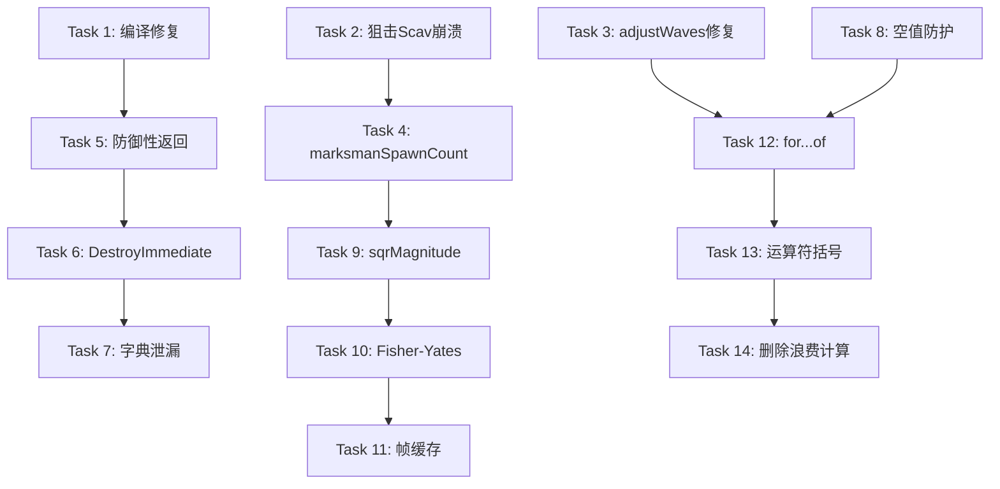

# ABPS Bug修复与性能优化实施计划

> **For agentic workers:** REQUIRED SUB-SKILL: Use superpowers:subagent-driven-development (recommended) or superpowers:executing-plans to implement this plan task-by-task. Steps use checkbox (`- [ ]`) syntax for tracking.

**Goal:** 修复 ABPS 模组中的关键 Bug、内存泄漏和稳定性问题，并优化运行时性能（减少 GC 分配和 CPU 开销）

**Architecture:** 分四个阶段实施 —— (1) 关键修复：阻止编译/运行时崩溃，(2) 稳定性：内存安全和资源管理，(3) 性能优化：距离检查 + 随机排序 + 列表缓存，(4) 代码质量：可读性和健壮性

**Tech Stack:** TypeScript (Server), C# / BepInEx / Harmony (Client), SPT 3.11.x

**前置条件:**
- 阅读 README.md 了解项目架构
- 确保可以编译 Client C# 项目 (VS/.NET) 和 Server TypeScript 项目
- 在 `Server/config/config.json` 中设置 `scavConfig.startingScavs.startingMarksman = true` 用于复现/验证 B2 修复

---

## 第1阶段：关键修复（阻止崩溃/功能错误）

### Task 1: 修复 BossSpawnTracking.cs 编译错误

**Files:**
- Modify: `Client/Spawning/BossSpawnTracking.cs`

- [ ] **Step 1: 修复 Dictionary 初始化语法**

当前第13行使用非法语法 `= [];`，替换为标准初始化：

```csharp
// 原 (第13行):
public static Dictionary<string, Dictionary<string, CustomizedObject>> BossInfoOutOfRaid { get; set; } = [];

// 改为:
public static Dictionary<string, Dictionary<string, CustomizedObject>> BossInfoOutOfRaid { get; set; } = new Dictionary<string, Dictionary<string, CustomizedObject>>();
```

- [ ] **Step 2: 添加 LoadFromServer 的空值防护**

在反序列化后添加 null 检查：

```csharp
// 第82行 (原):
BossInfoOutOfRaid = JsonConvert.DeserializeObject<Dictionary<string, Dictionary<string, CustomizedObject>>>(payload);

// 改为:
var deserialized = JsonConvert.DeserializeObject<Dictionary<string, Dictionary<string, CustomizedObject>>>(payload);
BossInfoOutOfRaid = deserialized ?? new Dictionary<string, Dictionary<string, CustomizedObject>>();

// 在第85行判断前添加 null 检查:
var profileID = Utility.GetPlayerProfile().ProfileId;
if (profileID != null && BossInfoOutOfRaid.ContainsKey(profileID))
```

- [ ] **Step 3: 验证编译**

```bash
cd Client
dotnet build acidphantasm-botplacementsystem.csproj
```
预期: Build succeeded.

---

### Task 2: 修复 ScavSpawnControl.ts 狙击 Scav 运行时崩溃

**Files:**
- Modify: `Server/src/Controls/ScavSpawnControl.ts`
- Modify: `Server/src/Defaults/MapSpawnZones.ts` (可选，如果不修改源数据)

- [ ] **Step 1: 修复 getMarksmanSpawnZones 返回 undefined 的问题**

将返回值从 `undefined` 改为空数组 `[]`：

```typescript
// 查找 case 返回 undefined 的 (第155-161行):
case "factory4_day":
case "factory4_night":
    return undefined;  // 改为 return [];
case "interchange":
    return undefined;  // 改为 return [];
case "laboratory":
    return undefined;  // 改为 return [];
case "rezervbase":
    return undefined;  // 改为 return [];
```

每个 `return undefined;` 全部替换为 `return [];`。

- [ ] **Step 2: 在 generateStartingScavs 中添加防御性检查**

在第77行附近，重构生成区域获取逻辑：

```typescript
// 原 (第77行):
const availableSpawnZones = botRole == "assault" 
    ? createExhaustableArray(this.getNonMarksmanSpawnZones(location), this.randomUtil, this.cloner) 
    : createExhaustableArray(this.getMarksmanSpawnZones(location), this.randomUtil, this.cloner);

// 改为:
const spawnZones = botRole == "assault" 
    ? (this.getNonMarksmanSpawnZones(location) ?? [])
    : (this.getMarksmanSpawnZones(location) ?? []);

if (botRole !== "assault" && spawnZones.length === 0) {
    return []; // 该地图无狙击生成区域，跳过
}

const availableSpawnZones = createExhaustableArray(spawnZones, this.randomUtil, this.cloner);
```

- [ ] **Step 3: 验证修复**

在配置中确保 `scavConfig.startingScavs.startingMarksman = true`，启动 SPT 服务器，进入所有支持狙击 Scav 的地图（海关/灯塔/GZ/海岸线/街区/森林），确认不崩溃。

预期的服务器日志无异常。

---

### Task 3: 修复 MapSpawnControl.adjustWaves 丢弃 Boss 波次的逻辑错误

**Files:**
- Modify: `Server/src/Controls/MapSpawnControl.ts`

- [ ] **Step 1: 重写 adjustWaves 方法 (第215-236行)**

用清晰的分组逻辑替代当前的三行过滤：

```typescript
public adjustWaves(mapBase: ILocationBase, raidAdjustments: IRaidChanges): void
{
    const locationName = mapBase.Id.toLowerCase();
    const skipSeconds = Math.max(0, raidAdjustments.simulatedRaidStartSeconds);
    
    if (skipSeconds <= 60)
    {
        return; // 几乎不需要调整
    }

    // 保留战局开始时的固定波次 (Time == -1)
    const startWaves = mapBase.BossLocationSpawn.filter((x) => x.Time === -1);

    // 获取所有时间在 skipSeconds 之后的波次 (包括 PMC 和非 PMC 定时波次)
    const remainingTimed = mapBase.BossLocationSpawn.filter((x) => x.Time > skipSeconds);

    // 对保留的波次进行时间偏移（减去已过时间）
    for (const wave of remainingTimed)
    {
        wave.Time -= skipSeconds;
    }

    // 重新生成剩余时间内可能出现的起始 PMC
    const totalRemainingTime = raidAdjustments.raidTimeMinutes * 60;
    const newStartingPMCs = this.pmcSpawnControl.generateScavRaidRemainingPMCs(locationName, totalRemainingTime);

    // 重新生成起始 Scav
    const newStartingScavs = this.scavSpawnControl.generateStartingScavs(locationName, "assault", true);

    // 组合: 偏移过的定时波次 + 新生成的 PMC + 固定起始波次
    mapBase.BossLocationSpawn = [
        ...remainingTimed,
        ...newStartingPMCs,
        ...startWaves,
    ];

    // 将新 Scav 加入 waves
    for (const scavWave of newStartingScavs)
    {
        mapBase.waves.push(scavWave);
    }
}
```

- [ ] **Step 2: 验证逻辑正确性**

手动追踪以下场景:
- 条件: 海关, EscapeTimeLimit=35分钟, simulatedRaidStartSeconds=900
- 预期: 
  - Time==-1 的 Boss 波次保留
  - Time>900 的波次保留且 Time -= 900
  - Time<=900 且 !=-1 的波次被丢弃
  - 新 PMC 根据剩余时间 (~1200秒) 生成 1-6 人
  - 新 Scav 正常生成

---

### Task 4: 修复 ScavSpawnControl.ts marksmanSpawnCount 初始值错误

**Files:**
- Modify: `Server/src/Controls/ScavSpawnControl.ts`

- [ ] **Step 1: 修改 marksmanSpawnCount 初始值**

```typescript
// 原 (第79行):
let marksmanSpawnCount = scavCap;

// 改为:
let marksmanSpawnCount = waveLength;
```

`waveLength` 是当前地图已有 waves 数组的长度，作为起始偏移量。这使得 marksman 的 `number` 字段从正确的索引开始。

> 注: `number` 字段在此上下文中被用作顺序索引而非生成数量，该用法在 SPT 的 `IWave` 协议中是有效的索引值。

---

## 第2阶段：稳定性与安全修复

### Task 5: 为 getDefaultValuesForBoss/PMC 添加防御性返回

**Files:**
- Modify: `Server/src/Controls/BossSpawnControl.ts`
- Modify: `Server/src/Controls/PMCSpawnControl.ts`

- [ ] **Step 1: 修改 BossSpawnControl.ts 的 getDefaultValuesForBoss (第144-186行)**

将 `default` 分支从返回 `undefined` 改为记录错误并返回空数组：

```typescript
// 原 (第182-185行):
default:
    this.logger.error(`[ABPS] Boss not found in config ${boss}`)
    return undefined;
```

```typescript
// 改为:
default:
    this.logger.error(`[ABPS] Boss not found in config: ${boss}. Skipping.`);
    return [];
```

- [ ] **Step 2: 在 BossSpawnControl.getConfigValueForLocation 添加长度检查 (第52行附近)**

在 `const bossDefaultData = this.cloner.clone(...)` 之后添加：

```typescript
const bossDefaultData = this.cloner.clone(this.getDefaultValuesForBoss(boss, location));
if (!bossDefaultData || bossDefaultData.length === 0) continue;

const bossConfigData = ModConfig.config.bossConfig[boss];
// ... 后续逻辑
```

将 `bossConfigData` 的声明移到空数组检查之后（调整代码顺序）。

- [ ] **Step 3: 修改 PMCSpawnControl.ts 的 getDefaultValuesForBoss (第148-160行)**

```typescript
// 原 (第156-159行):
default:
    this.logger.error(`[ABPS] PMC not found in config ${boss}`)
    return undefined;
```

```typescript
// 改为:
default:
    this.logger.error(`[ABPS] PMC not found in config: ${boss}. Skipping.`);
    return [];
```

- [ ] **Step 4: 在两个方法的调用处添加空数组检查**

在 `generateStartingPMCWaves` 和 `generatePMCWaves` 中 (第78行附近, 第128行附近)，`getDefaultValuesForBoss` 调用之后添加：

```typescript
const bossDefaultData = this.cloner.clone(this.getDefaultValuesForBoss(pmcType));
if (!bossDefaultData || bossDefaultData.length === 0) continue; // 跳过无法识别的 PMC 类型
```

---

### Task 6: 替换 DestroyImmediate 为安全销毁

**Files:**
- Modify: `Client/Patches/NewSpawnPatches.cs`

- [ ] **Step 1: 重写 AttemptToDespawnBot 方法 (第187-206行)**

```csharp
private static void AttemptToDespawnBot(BotsController botsController, BotOwner botToDespawn)
{
    var effectsCommutator = Singleton<Effects>.Instance.EffectsCommutator;
    var gameWorld = Singleton<GameWorld>.Instance;

    if (effectsCommutator is null || gameWorld is null) return;

    var botOwner = botToDespawn;
    var botPlayer = botToDespawn.GetPlayer;

    // 先停止游戏逻辑
    effectsCommutator.StopBleedingForPlayer(botPlayer);
    botToDespawn.Deactivate();
    
    // 注销玩家
    gameWorld.UnregisterPlayer(botOwner);
    gameWorld.UnregisterPlayer(botPlayer);
    
    // 通知 BotsController
    botsController.BotDied(botOwner);
    botsController.DestroyInfo(botPlayer);

    // 使用 Destroy 而非 DestroyImmediate（安全，在下一帧执行）
    UnityEngine.Object.Destroy(botOwner.gameObject);
    UnityEngine.Object.Destroy(botOwner);
}
```

关键变更:
- 移除 `UnityEngine.Object.DestroyImmediate(botOwner.gameObject)` —— 运行时危险
- 移除 `UnityEngine.Object.Destroy(botOwner)` 的冗余调用（Destroy(gameObject) 会连带销毁组件）
- 将 `Dispose()` 移除（`Destroy` 会处理）
- 先 Deactivate 再 Unregister 再 BotDied，最后 Destroy

---

### Task 7: 清理 PmcGroupSpawner 静态字典泄漏

**Files:**
- Modify: `Client/Spawning/PMCSpawning.cs`

- [ ] **Step 1: 在 SpawnFollowers 完成后清理 wavePmcGroupClassData**

在 `StartSpawnPMCGroup` 方法（第23-64行）中，找到 `await SpawnFollowers(...)` 调用后，添加清理：

对于 flag==true 路径 (第55行后):
```csharp
await SpawnLeader(@class.creationData, spawnPoint, @class.botZone, @class.followersCount, botProfileDataClass, new Action<BotOwner>(@class.method_0));
await SpawnFollowers(@class.creationData, @class.botZone, @class.followersCount, @class.spawnParams, @class.wave, @class.side, @class.openedPositions, true, leaderProfileId);
// 小队已生成完毕，不再需要此数据
allPmcGroups.Remove(leaderProfileId);
```

对于 flag==false 路径 (第62行):
```csharp
if (followersCount != 0) wavePmcGroupClassData[leaderProfileId] = @class;
await SpawnLeader(@class.creationData, spawnPoint, @class.botZone, @class.followersCount, botProfileDataClass, new Action<BotOwner>(@class.method_0));
```

注意: `flag==false` 路径通过 `SpawnBot` 中的回调触发 `SpawnFollowers`，所以在 `SpawnBot` 方法（第251-281行）的 `SpawnFollowers` 之后也要清理。

- [ ] **Step 2: 在 SpawnBot 中 follower 生成后清理**

在 `SpawnBot` 方法末尾 (第276-280行):
```csharp
// 原:
var spawnedBotProfileId = data.Profiles[0].ProfileId;
if (!wavePmcGroupClassData.TryGetValue(spawnedBotProfileId, out var originalClassData)) return;

// Spawn boss followers now
SpawnFollowers(@originalClassData.creationData, @originalClassData.botZone, @originalClassData.followersCount, @originalClassData.spawnParams, @originalClassData.wave, @originalClassData.side, @originalClassData.openedPositions, true, spawnedBotProfileId);
```

```csharp
// 改为:
var spawnedBotProfileId = data.Profiles[0].ProfileId;
if (wavePmcGroupClassData.TryGetValue(spawnedBotProfileId, out var originalClassData))
{
    // Spawn boss followers now
    SpawnFollowers(@originalClassData.creationData, @originalClassData.botZone, @originalClassData.followersCount, @originalClassData.spawnParams, @originalClassData.wave, @originalClassData.side, @originalClassData.openedPositions, true, spawnedBotProfileId);
    // 已取出并处理，移除条目避免泄漏
    wavePmcGroupClassData.Remove(spawnedBotProfileId);
}
```

---

### Task 8: 添加 locationData 空值防护

**Files:**
- Modify: `Server/src/Controls/MapSpawnControl.ts`

- [ ] **Step 1: 在 configureInitialData 中添加守卫**

在第51-57行区域:

```typescript
for (const mapName of this.validMaps)
{
    // 添加守卫
    const mapEntry = this.locationData[mapName];
    if (!mapEntry || !mapEntry.base) {
        this.logger.warning(`[ABPS] Map "${mapName}" not found in location database. Skipping.`);
        continue;
    }

    mapEntry.base.BossLocationSpawn = [];
    this.botMapCache[mapName] = [];
    this.scavMapCache[mapName] = [];
    // ... 后续逻辑使用 mapEntry 替代 this.locationData[mapName]
```

后续行中的 `this.locationData[mapName].base` 全部改为 `mapEntry.base`。

- [ ] **Step 2: 同样更新 rebuildCache 方法 (第167行)**

```typescript
const mapName = location.toLowerCase();
const mapEntry = this.locationData[mapName];
if (!mapEntry || !mapEntry.base) {
    this.logger.warning(`[ABPS] Map "${mapName}" not found during rebuild. Skipping.`);
    return;
}
```

---

## 第3阶段：性能优化

### Task 9: 用 sqrMagnitude 替代 Vector3.Distance

**Files:**
- Modify: `Client/Patches/BossSpawnPatches.cs` (IsValid helper)
- Modify: `Client/Patches/NewSpawnPatches.cs` (IsValid helper + DespawnFurthestBots)

- [ ] **Step 1: 重构 BossSpawnPatches.cs 的 IsValid 方法 (第182-216行)**

```csharp
private static bool IsValid(ISpawnPoint spawnPoint, IReadOnlyCollection<IPlayer> players, float distance, bool checkAgainstMainPlayer = false)
{
    if (spawnPoint == null) return false;
    if (spawnPoint.Collider == null) return false;

    // 预计算距离平方，避免每循环一次算一次平方
    float distanceSq = distance * distance;

    if (Singleton<GameWorld>.Instance.MainPlayer != null)
    {
        var mainPlayer = Singleton<GameWorld>.Instance.MainPlayer;
        if (checkAgainstMainPlayer && mainPlayer.Side == EPlayerSide.Savage)
        {
            // 改用 sqrMagnitude
            if ((spawnPoint.Position - mainPlayer.Position).sqrMagnitude < distanceSq)
            {
                return false;
            }
        }
    }
    if (players != null && players.Count != 0)
    {
        foreach (IPlayer player in players)
        {
            if (player == null || player.Profile.GetCorrectedNickname().StartsWith("headless_"))
            {
                continue;
            }
            if (spawnPoint.Collider.Contains(player.Position))
            {
                return false;
            }
            // 改用 sqrMagnitude
            if ((spawnPoint.Position - player.Position).sqrMagnitude < distanceSq)
            {
                return false;
            }
        }
    }
    return true;
}
```

同时将第143行 `Vector3.Distance(checkPoint.Position, validSpawnPoints[0].Position) <= 10f` 改为 `(checkPoint.Position - validSpawnPoints[0].Position).sqrMagnitude <= 100f`。

- [ ] **Step 2: 重构 NewSpawnPatches.cs 的 IsValid 方法 (第322-348行)**

```csharp
private static bool IsValid(ISpawnPoint spawnPoint, IReadOnlyCollection<IPlayer> players, float distance)
{
    if (spawnPoint == null) return false;
    if (spawnPoint.Collider == null) return false;

    float distanceSq = distance * distance;

    if (players != null && players.Count != 0)
    {
        foreach (IPlayer player in players)
        {
            if (player == null || player.Profile.GetCorrectedNickname().StartsWith("headless_"))
            {
                continue;
            }
            if (spawnPoint.Collider.Contains(player.Position))
            {
                return false;
            }
            if ((spawnPoint.Position - player.Position).sqrMagnitude < distanceSq)
            {
                return false;
            }
        }
        return true;
    }
    return true;
}
```

- [ ] **Step 3: 重构 DespawnFurthestBots 中的距离检查 (第142-166行)**

```csharp
private static void DespawnFurthestBots(BotsController botsController)
{
    float despawnDistanceSq = Plugin.despawnDistance * Plugin.despawnDistance;
    var allBotsNoBosses = Utility.GetAllCachedBots();
    var botsToDespawn = new List<BotOwner>();
    var centerOfActivePlayerPlayers = GetCenterOfActivePlayers();

    foreach (var bot in allBotsNoBosses)
    {
        if (bot == null) continue;
        if (!bot.IsAI) continue;
        if (!Plugin.despawnPmcs && bot.Profile.Info.Side is EPlayerSide.Bear or EPlayerSide.Usec) continue;

        // 改用 sqrMagnitude
        if ((bot.Position - centerOfActivePlayerPlayers).sqrMagnitude >= despawnDistanceSq)
        {
            botsToDespawn.Add(bot.AIData.BotOwner);
        }
    }

    foreach (var botToDespawn in botsToDespawn)
    {
        AttemptToDespawnBot(botsController, botToDespawn);
    }
}
```

---

### Task 10: 用 Fisher-Yates 洗牌替代 OrderBy(Guid.NewGuid())

**Files:**
- Modify: `Client/Utils/Utility.cs` (添加洗牌方法, 重构 GetMapBotZones)
- Modify: `Client/Patches/BossSpawnPatches.cs` (重构 GetPlayerSpawnPoints + GetAnySpawnPoints)
- Modify: `Client/Patches/NewSpawnPatches.cs` (重构 GetValidBotZone, GetValidSpawnPoints, GetNewValidBotZone)

- [ ] **Step 1: 在 Utility.cs 中添加 Fisher-Yates 洗牌扩展方法**

```csharp
// 在 Utility 类中添加:
private static System.Random _shuffleRng = new System.Random();

public static void ShuffleInPlace<T>(List<T> list)
{
    for (int i = list.Count - 1; i > 0; i--)
    {
        int k = _shuffleRng.Next(i + 1);
        (list[k], list[i]) = (list[i], list[k]);
    }
}

public static List<T> ShuffleCopy<T>(List<T> list)
{
    var copy = new List<T>(list);
    ShuffleInPlace(copy);
    return copy;
}
```

- [ ] **Step 2: 重构 Utility.GetMapBotZones (第137-141行)**

```csharp
// 原:
public static List<BotZone> GetMapBotZones()
{
    List<BotZone> shuffledList = currentMapZones.OrderBy(_ => Guid.NewGuid()).ToList();
    return shuffledList;
}

// 改为:
public static List<BotZone> GetMapBotZones()
{
    return ShuffleCopy(currentMapZones);
}
```

- [ ] **Step 3: 重构 BossSpawnPatches.cs 中的 OrderBy(Guid)**

在 `GetPlayerSpawnPoints` (第131行) 和 `GetAnySpawnPoints` (第164行):

```csharp
// 原:
list = list.OrderBy(_ => Guid.NewGuid()).ToList();

// 改为:
Utility.ShuffleInPlace(list);
```

注意: 需要确保 list 是普通 List 而非 IReadOnlyList。`GetPlayerSpawnPoints` 通过 `Utility.GetPlayerSpawnPoints()` 已经返回 List。保持已有的 `ToList()` 调用不变，然后对结果调用 `ShuffleInPlace`。

- [ ] **Step 4: 重构 NewSpawnPatches.cs 中的 OrderBy(Guid)**

在 `NonWavesSpawnScenarioUpdatePatch.GetValidBotZone` (第211行):
```csharp
// 原:
botZones = botZones.OrderBy(_ => Guid.NewGuid()).ToList();

// 改为:
Utility.ShuffleInPlace(botZones);
```

在 `TryToSpawnInZonePatch.GetValidSpawnPoints` (第305行):
```csharp
// 原:
allSpawnPoints = allSpawnPoints.OrderBy(_ => Guid.NewGuid()).ToList();

// 改为:
Utility.ShuffleInPlace(allSpawnPoints);
```

在 `TryToSpawnInZonePatch.GetNewValidBotZone` (第400行):
```csharp
// 原:
return botZones.Where(x => !x.SnipeZone).ToList().OrderBy(_ => Guid.NewGuid()).FirstOrDefault();

// 改为: (Fisher-Yates 用于随机选择不需要全局排序，直接随机选即可)
var candidates = botZones.Where(x => !x.SnipeZone).ToList();
if (candidates.Count == 0) return null;
return candidates[_shuffleRng.Next(candidates.Count)];
```

但 `_shuffleRng` 是 Utility 的私有字段。在此改为:
```csharp
var candidates = botZones.Where(x => !x.SnipeZone).ToList();
if (candidates.Count == 0) return null;
Utility.ShuffleInPlace(candidates);
return candidates[0];
```

---

### Task 11: 缓存 GetAllPMCs / GetAllScavs 每帧结果

**Files:**
- Modify: `Client/Utils/Utility.cs`

- [ ] **Step 1: 添加帧缓存机制**

当 `NonWavesSpawnScenarioUpdatePatch` 在一个 Update 周期内多次调用 `GetAllPMCs()` / `GetAllScavs()` 时，每帧结果应该相同。使用帧计数器缓存：

```csharp
// 在 Utility 类中添加:
private static int _lastFrame = -1;

private static void InvalidateCacheIfNewFrame()
{
    int currentFrame = UnityEngine.Time.frameCount;
    if (currentFrame != _lastFrame)
    {
        _lastFrame = currentFrame;
        allPMCs.Clear();
        allScavs.Clear();
    }
}

public static List<IPlayer> GetAllPMCs()
{
    InvalidateCacheIfNewFrame();
    if (allPMCs.Count > 0) return allPMCs;

    var gameWorld = Singleton<GameWorld>.Instance;
    if (gameWorld != null)
    {
        var pmcs = gameWorld.RegisteredPlayers
            .Where(x => x.Profile.Side == EPlayerSide.Bear || x.Profile.Side == EPlayerSide.Usec)
            .ToList();
        allPMCs.AddRange(pmcs);
    }
    return allPMCs;
}

public static List<IPlayer> GetAllScavs()
{
    InvalidateCacheIfNewFrame();
    if (allScavs.Count > 0) return allScavs;

    var gameWorld = Singleton<GameWorld>.Instance;
    if (gameWorld != null)
    {
        var scavs = gameWorld.RegisteredPlayers
            .Where(x => x.Profile.Info.Settings.Role == WildSpawnType.assault)
            .ToList();
        allScavs.AddRange(scavs);
    }
    return allScavs;
}
```

- [ ] **Step 2: 在 PMCWaveCountPatch 中重置帧缓存**

由于 `PMCWaveCountPatch` 已在战局开始时重置各类列表，确认它也重置帧计数：

```csharp
// 在 BossSpawnPatches.cs 的 PMCWaveCountPatch.PatchPostfix 中 (第26-37行):
private static void PatchPostfix(BossSpawnScenario __instance, BossLocationSpawn[] bossWaves)
{
    if (__instance == null) return;

    Utility.currentMapZones = new List<BotZone>();
    Utility.mapName = string.Empty;
    Utility.allPMCs = new List<IPlayer>();
    Utility.allBots = new List<IPlayer>();
    Utility.allSpawnPoints.Clear();
    Utility.playerSpawnPoints.Clear();
    Utility.backupPlayerSpawnPoints.Clear();
    Utility.combinedSpawnPoints.Clear();
    // 无需显式重置帧缓存 —— 帧号变化会自动触发 InvalidateCacheIfNewFrame
}
```

---

## 第4阶段：代码质量

### Task 12: 将 for...in 改为 for...of (TypeScript 数组成员迭代)

**Files:**
- Modify: `Server/src/Controls/MapSpawnControl.ts`

- [ ] **Step 1: 全局搜索替换 for...in → for...of**

在 `MapSpawnControl.ts` 中，找到所有对 `this.validMaps` 使用的 `for (const map in this.validMaps)` 模式:

**位置1** - `configureInitialData` (第51行):
```typescript
// 原:
for (const map in this.validMaps)
{
    const mapName = this.validMaps[map];

// 改为:
for (const mapName of this.validMaps)
{
```

**位置2** - `buildBossWaves` (第128行):
```typescript
// 原:
for (const map in this.validMaps)
{
    const mapName = this.validMaps[map];

// 改为:
for (const mapName of this.validMaps)
{
```

**位置3** - `buildPMCWaves` (第138行):
```typescript
// 原:
for (const map in this.validMaps)
{
    const mapName = this.validMaps[map];

// 改为:
for (const mapName of this.validMaps)
{
```

**位置4** - `buildStartingScavs` (第148行):
```typescript
// 原:
for (const map in this.validMaps)
{
    const mapName = this.validMaps[map];

// 改为:
for (const mapName of this.validMaps)
{
```

**位置5** - `replaceOriginalLocations` (第159行):
```typescript
// 原:
for (const map in this.validMaps)
{
    const mapName = this.validMaps[map];

// 改为:
for (const mapName of this.validMaps)
{
```

共5处替换。每次替换时删除 `const mapName = this.validMaps[map];` 行。

---

### Task 13: 修复 BossSpawnControl.ts 中的运算符优先级歧义

**Files:**
- Modify: `Server/src/Controls/BossSpawnControl.ts`

- [ ] **Step 1: 添加括号明确优先级 (第58行)**

```typescript
// 原 (第58行):
if (boss == "exUsec" && !bossConfigData.disableVanillaSpawns && location == "lighthouse" || boss == "pmcBot" && !bossConfigData.disableVanillaSpawns && (location == "laboratory" || location == "rezervbase"))

// 改为:
if ((boss == "exUsec" && !bossConfigData.disableVanillaSpawns && location == "lighthouse") || (boss == "pmcBot" && !bossConfigData.disableVanillaSpawns && (location == "laboratory" || location == "rezervbase")))
```

行为不变（因为 `&&` 原生优先级高于 `||`），但提升可读性。

---

### Task 14: 移除 generateScavRaidRemainingPMCs 中的浪费计算

**Files:**
- Modify: `Server/src/Controls/PMCSpawnControl.ts`

- [ ] **Step 1: 删除无条件被覆盖的初始随机 (第168行)**

```typescript
// 原 (第166-168行):
const minPMCCount = ModConfig.config.pmcConfig.startingPMCs.mapLimits[location].min;
const maxPMCCount = ModConfig.config.pmcConfig.startingPMCs.mapLimits[location].max;
let generatedPMCCount = this.randomUtil.getInt(minPMCCount, maxPMCCount); // <-- 浪费

// 改为 (直接声明，不需要初始值):
const minPMCCount = ModConfig.config.pmcConfig.startingPMCs.mapLimits[location].min;
const maxPMCCount = ModConfig.config.pmcConfig.startingPMCs.mapLimits[location].max;
let generatedPMCCount: number; // 将在下方根据剩余时间赋值
```

确认 `generatedPMCCount` 在下方所有分支（第177-179行及之后）都有赋值，不会出现 `undefined` 情况。当前逻辑：第177-179行三个 `if` 覆盖了所有情况，最后一个 `if` 是 `<1800`（包括正常值），且后面还有 `factory` 缩减逻辑。所以是安全的。

---

## 实施顺序与依赖关系



**建议批处理:**
- **批次A** (独立, 并行): Task 1 + Task 2 + Task 4 + Task 8 + Task 13
- **批次B** (依赖A): Task 3 + Task 5 + Task 12 + Task 14
- **批次C** (依赖B): Task 6 + Task 7
- **批次D** (依赖C): Task 9 + Task 10 + Task 11

每个批次完成后提交一次，便于回滚。

---

## 验证清单

在全部任务完成后，在本地环境执行以下验证：

- [ ] Client C# 编译通过 (`dotnet build`)
- [ ] SPT 服务器启动后无异常日志
- [ ] 启用 `startingMarksman=true` 进入海关/灯塔/森林，确认无崩溃
- [ ] 以 Scav 身份中途加入战局，确认 Boss 正常出现
- [ ] 进入实验室，确认 Raider 波次正常生成
- [ ] 进入海关，确认起始 PMC 和起始 Scav 正常生成
- [ ] 进入工厂，确认 Tagilla 生成正常且无重复波次
- [ ] 使用性能分析工具 (如 Unity Profiler) 对比优化前后帧数
- [ ] 运行多局游戏，确认 `bossTrackingData.json` 正常写入和读取
- [ ] 确认 `wavePmcGroupClassData` 和 `allPmcGroups` 字典不会无限增长
